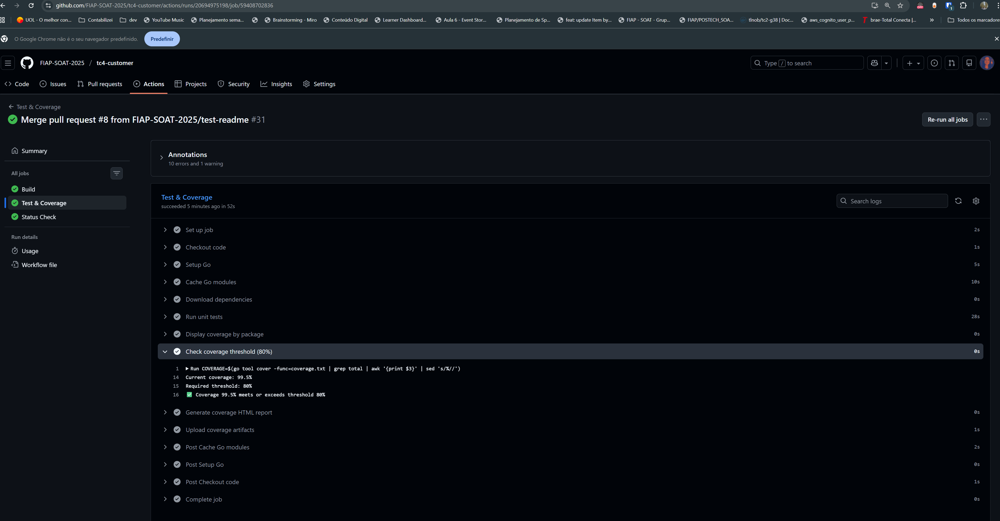
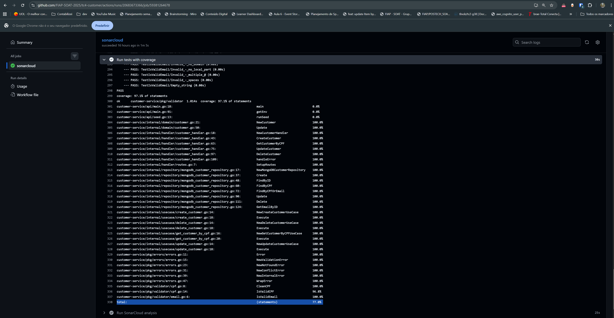

# Microsserviço de Customer

Um microsserviço em Go para gerenciamento de clientes com MongoDB, extraído do projeto NestJS TC2-G38.

## Funcionalidades

- Arquitetura Limpa com separação de responsabilidades
- Design orientado a domínio
- Validação de CPF e Email
- MongoDB como banco de dados NoSQL
- API RESTful com framework Gin
- Testes unitários e de integração abrangentes
- Suporte a Docker e docker-compose
- Mesmos contratos de endpoint do serviço NestJS original

## Justificativa da Stack

### Por que Go?

- **Performance**: Go compila para binários nativos, oferecendo tempo de inicialização extremamente rápido (~50ms) e baixo consumo de memória (~10-20MB), ideal para microsserviços em containers
- **Ecossistema cloud-native**: Kubernetes, Docker e a maioria das ferramentas de infraestrutura moderna são escritas em Go
- **Binário único**: Deploy simplificado sem necessidade de runtime ou dependências externas

### Por que MongoDB?

- **Modelo de dados flexível**: Documentos JSON permitem evolução do schema sem migrações complexas
- **Escalabilidade horizontal**: Sharding nativo para distribuir dados entre múltiplos nós
- **Performance em leituras**: Índices eficientes e suporte a queries por campos específicos como CPF
- **Integração natural com Go**: Driver oficial com suporte a contextos e operações assíncronas
- **Adequado para microsserviços**: Cada serviço pode ter seu próprio banco isolado, evitando acoplamento

### Go + MongoDB para Microsserviços

A combinação de Go e MongoDB é particularmente eficaz para microsserviços de domínio simples como gerenciamento de clientes:

- **Baixa latência**: Resposta típica < 10ms para operações CRUD
- **Custo operacional reduzido**: Menor consumo de recursos comparado a stacks como Node.js/PostgreSQL
- **Containers leves**: Imagem Docker final com ~15MB
- **Resiliência**: Reconexão automática e circuit breakers nativos no driver MongoDB

## Arquitetura

```
customer-service-go/
├── api/              # Ponto de entrada da aplicação
├── internal/
│   ├── domain/          # Entidades e regras de negócio
│   ├── usecase/         # Lógica de negócio
│   ├── repository/      # Camada de persistência de dados
│   └── handler/         # Handlers HTTP
├── pkg/
│   ├── validator/       # Utilitários de validação (CPF, Email)
│   └── errors/          # Tipos de erro customizados
└── test/                # Testes de integração
```

## Pré-requisitos

- Go 1.21 ou superior
- Docker e Docker Compose (para implantação em contêineres)
- MongoDB 7.0+ (se executar localmente sem Docker)

## Instalação

### Usando Docker Compose (Recomendado)

1. Clone o repositório e navegue até o diretório do serviço:
```bash
cd customer-service-go
```

2. Crie um arquivo `.env` ou use variáveis de ambiente (veja a seção Configuração)

3. Inicie os serviços:
```bash
docker-compose up -d
```

O serviço estará disponível em `http://localhost:8080`

### Desenvolvimento Local

1. Instale as dependências:
```bash
go mod download
```

2. Copie o arquivo de ambiente:
```bash
cp .env.example .env
```

3. Inicie o MongoDB (se não estiver usando Docker):
```bash
docker run -d -p 27017:27017 --name mongodb mongo:7.0
```

4. Execute a aplicação:
```bash
go run api/main.go
```

Ou usando Make:
```bash
make run
```

---

## Swagger / OpenAPI 📖

Adicionei as anotações necessárias nos handlers e uma rota `/swagger/*any` que expõe a UI do Swagger.

Passos para gerar a documentação e executar a UI localmente:

1. Instale o gerador `swag` (CLI):
```bash
go install github.com/swaggo/swag/cmd/swag@latest
```

2. Instale as dependências de runtime para servir a UI:
```bash
go get -u github.com/swaggo/gin-swagger@latest github.com/swaggo/files@latest
```

3. Gere os arquivos de documentação (executar a partir do root do projeto):
```bash
swag init -g api/main.go -o docs
```

4. Rode a aplicação:
```bash
go run api/main.go
```

5. Acesse a UI em: `http://localhost:8080/swagger/index.html`

Observação: criei um pacote `docs` mínimo para permitir builds locais mesmo antes de gerar usando `swag init`. Recomendo executar `swag init` para ter a documentação completa e atualizada.

## Configuração

O serviço usa variáveis de ambiente para configuração:

| Variável | Descrição | Padrão |
|----------|-----------|--------|
| `MONGODB_URI` | URI de conexão do MongoDB | `mongodb://mongodb:27017` |
| `MONGODB_DATABASE` | Nome do banco de dados | `customer_db` |
| `MONGODB_PORT` | Porta do MongoDB (para docker-compose) | `27017` |
| `PORT` | Porta do servidor | `8080` |

### Desenvolvimento Local

Crie um arquivo `.env`:
```bash
MONGODB_URI=mongodb://localhost:27017
MONGODB_DATABASE=customer_db
MONGODB_PORT=27017
PORT=8080
```

### Produção/CI/CD

Defina estas como variáveis de ambiente ou secrets do GitHub:
```bash
export MONGODB_URI="mongodb://seu-host-de-producao:27017"
export MONGODB_DATABASE="customer_db"
export PORT="8080"
```

### GitHub Actions/CI

Defina estas como secrets do repositório:
- `MONGODB_URI` - URI do MongoDB de produção
- `MONGODB_DATABASE` - Nome do banco de dados
- `MONGODB_PORT` - Porta do MongoDB
- `PORT` - Porta da aplicação
- `DOCKER_USERNAME` - Nome de usuário do Docker Hub
- `DOCKER_PASSWORD` - Senha/token do Docker Hub

## Postman Collection

Uma coleção do Postman está disponível em [`postman/tc4-customer.postman_collection.json`](postman/tc4-customer.postman_collection.json) com todos os endpoints da API, incluindo exemplos de requisições e respostas.

Para importar: Abra o Postman → Import → selecione o arquivo JSON.

## Endpoints da API

Todos os endpoints mantêm os mesmos contratos do serviço NestJS original.

### Criar Cliente
```http
POST /customer
Content-Type: application/json

{
  "name": "João Silva",
  "cpf": "111.444.777-35",
  "email": "joao@exemplo.com"
}
```

**Exemplo com curl:**
```bash
curl -X POST http://localhost:8080/customer \
  -H "Content-Type: application/json" \
  -d '{"name": "João Silva", "cpf": "111.444.777-35", "email": "joao@exemplo.com"}'
```

**Resposta (201 Created):**
```json
{
  "id": "uuid",
  "name": "João Silva",
  "cpf": "11144477735",
  "email": "joao@exemplo.com",
  "createdAt": "2024-01-01T00:00:00Z",
  "updatedAt": "2024-01-01T00:00:00Z"
}
```

### Buscar Cliente por CPF
```http
GET /customer/:cpf
```

**Exemplo com curl:**
```bash
curl http://localhost:8080/customer/11144477735
```

**Resposta (200 OK):**
```json
{
  "id": "uuid",
  "name": "João Silva",
  "cpf": "11144477735",
  "email": "joao@exemplo.com",
  "createdAt": "2024-01-01T00:00:00Z",
  "updatedAt": "2024-01-01T00:00:00Z"
}
```

### Atualizar Cliente
```http
PATCH /customer/:id
Content-Type: application/json

{
  "name": "Maria Silva",
  "email": "maria@exemplo.com"
}
```

**Exemplo com curl:**
```bash
curl -X PATCH http://localhost:8080/customer/seu-uuid-do-cliente \
  -H "Content-Type: application/json" \
  -d '{"name": "Maria Silva", "email": "maria@exemplo.com"}'
```

**Resposta (200 OK):**
```json
{
  "id": "uuid",
  "name": "Maria Silva",
  "cpf": "11144477735",
  "email": "maria@exemplo.com",
  "createdAt": "2024-01-01T00:00:00Z",
  "updatedAt": "2024-01-01T12:00:00Z"
}
```

### Deletar Cliente
```http
DELETE /customer/:id
```

**Exemplo com curl:**
```bash
curl -X DELETE http://localhost:8080/customer/seu-uuid-do-cliente
```

**Resposta (204 No Content)**

### Verificação de Saúde
```http
GET /health
```

**Exemplo com curl:**
```bash
curl http://localhost:8080/health
```

**Resposta (200 OK):**
```json
{
  "status": "healthy",
  "service": "customer-service"
}
```

## Respostas de Erro

Todos os erros seguem o mesmo formato do serviço NestJS:

```json
{
  "message": "Descrição do erro",
  "statusCode": 400,
  "error": "CODIGO_DO_ERRO"
}
```

### Códigos de Erro

- `NAME_EMPTY` (400): O nome não pode estar vazio
- `INVALID_CPF` (400): Formato de CPF inválido
- `INVALID_EMAIL` (400): Formato de email inválido
- `CUSTOMER_ALREADY_EXISTS` (409): Cliente com mesmo CPF ou email já existe
- `CUSTOMER_NOT_FOUND` (404): Cliente não encontrado
- `INTERNAL_ERROR` (500): Erro interno do servidor

## Testes

### BDD 

Os cenários de teste estão documentados em formato BDD. Veja os cenários de comportamento em:
- [`internal/domain/customer_test.go.feature`](internal/domain/customer_test.go.feature) - Especificação BDD dos testes de domínio

### Executar Todos os Testes
```bash
make test
```

Ou:
```bash
go test -v ./...
```

### Executar Apenas Testes Unitários
```bash
make test-unit
```

Ou:
```bash
go test -v -short ./...
```

### Executar Testes de Integração

Os testes de integração requerem MongoDB. Você pode executá-los com o script fornecido:

```bash
./test-integration.sh
```

Ou manualmente:
```bash
# Inicie o MongoDB para testes
docker run -d --name mongodb-test -p 27018:27017 mongo:7.0

# Execute os testes de integração
TEST_MONGODB_URI="mongodb://localhost:27018" go test -v -tags=integration ./internal/repository/

# Limpeza
docker stop mongodb-test && docker rm mongodb-test
```

### Cobertura de Testes
```bash
go test -v -race -coverprofile=coverage.txt -covermode=atomic ./...
go tool cover -html=coverage.txt
```

### Evidência de Testes Unitários

Os testes unitários são executados automaticamente via GitHub Actions em cada push e pull request. Cobertura > 90%.



### Cobertura SonarCloud

Este projeto usa SonarCloud para análise contínua de qualidade e cobertura de código. O relatório de cobertura é gerado automaticamente em cada push para `main` e em pull requests. Cobertura > 70%.



## Build

### Build do Binário
```bash
make build
```

Ou:
```bash
go build -o bin/customer-service ./api
```

### Build da Imagem Docker
```bash
make docker-build
```

Ou:
```bash
docker build -t customer-service .
```

## Desenvolvimento

### Estrutura do Projeto

- **api**: Ponto de entrada da aplicação e função main
- **internal/domain**: Entidades de negócio (Customer, CPF, Email value objects)
- **internal/usecase**: Lógica de negócio (Create, Update, Delete, GetByCPF)
- **internal/repository**: Camada de acesso a dados com implementação MongoDB
- **internal/handler**: Handlers HTTP e roteamento
- **pkg/validator**: Funções de validação reutilizáveis
- **pkg/errors**: Tipos de erro customizados

### Adicionando Novas Funcionalidades

1. Defina entidades de domínio em `internal/domain`
2. Crie casos de uso em `internal/usecase`
3. Implemente métodos do repositório em `internal/repository`
4. Adicione handlers HTTP em `internal/handler`
5. Atualize rotas em `internal/handler/routes.go`
6. Escreva testes para todas as camadas

## Migração do NestJS

Este serviço mantém 100% de compatibilidade de API com o módulo de clientes NestJS original:

- Mesmos endpoints: `POST /customer`, `GET /customer/:cpf`, `PATCH /customer/:id`, `DELETE /customer/:id`
- Mesmos formatos de requisição/resposta
- Mesmas regras de validação (CPF, Email)
- Mesmos códigos e mensagens de erro
- Mesma lógica de negócio

### Diferenças

- **Banco de Dados**: PostgreSQL → MongoDB
- **Linguagem**: TypeScript → Go
- **Framework**: NestJS → Gin
- **Arquitetura**: Arquitetura Limpa mantida em ambos

## Serviços do Docker Compose

O `docker-compose.yml` inclui:

- **mongodb**: Banco de dados MongoDB 7.0
- **customer-service**: O microsserviço em Go

Ambos os serviços estão conectados via rede bridge `customer-network`.

## Comandos do Makefile

```bash
make help              # Mostrar comandos disponíveis
make build             # Compilar a aplicação
make run               # Executar a aplicação localmente
make test              # Executar todos os testes
make test-unit         # Executar apenas testes unitários
make test-integration  # Executar testes de integração
make clean             # Limpar artefatos de build
make docker-build      # Compilar imagem Docker
make docker-up         # Iniciar serviços do docker-compose
make docker-down       # Parar serviços do docker-compose
make docker-logs       # Visualizar logs do docker-compose
```


## 👥 Equipe

| Nome | RM |
|------|-----|
| **Daniela Rêgo Lima de Queiroz** | RM361289 |
| **Diana Bianca Santos Rodrigues** | RM361570 |
| **Felipe Alves Teixeira** | RM362585 |
| **Luiz Manoel Resplande Oliveira** | RM363920 |
| **Thaís Lima de Oliveira Nobre** | RM362744 |


## 📝 Licença

Este projeto foi desenvolvido como parte do Tech Challenge da FIAP - Pós-graduação em Software Architecture.
